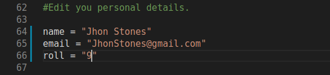

# Google-Form-Automation

Why spend minutes when all you need is seconds.

# Why this project ?

We are having regular online classes in our college where attendance is taken by google forms. So I decided to automate a part of it.Suggestions and pull request are most welcome.From here we divide the use cases for two needs:  
i. My classmates reading in the same section 
ii. People who want to use it as a template  

<<<<<<< HEAD
# Features :
=======
There are two scripts  1> `test_script` : If your form has no additional recaptcha
   2> `attendance` script : If the form has a recaptcha. 
 p.s. :I have added workaround for the recaptcha i.e. opening the form in browswer.I wish to add recaptcha bypassing using DL later.
>>>>>>> ffb1b61c9411c97296ee9ee7fc2751ca56317866

We have implemented most of the form features in google form.
<ol>

1. Filling forms having multiple sections.
2. Filling the date
3. Filling Email-address
4. Filling numbers
5. Filling checkboxes/mutliple choices
6. Interaction using Terminal
7. Workaround to avoid Recaptcha
8. Minimum dependency
</ol> 

<<<<<<< HEAD
## For my classmates  (IEM ECE 2nd year sec-A) 
=======
You can use these scripts as template or  if you are from the same class as mine :) you can just edit the personal details in the script. If you are using it as a template you may need to add your own URL and entry points for the data.
>>>>>>> ffb1b61c9411c97296ee9ee7fc2751ca56317866

Follow these steps to register your attendence.
<ul>

<<<<<<< HEAD
* You need to clone the repository by clicking on the </img> to the local machine.Extract the zip(if applicable).
=======
Clone the repository to your local machine and copy the address of the folder. In this case the address is `home/user/`. This project has been developed using minimum dependencies and packages that come with base python installation.Feel free to recheck if all packages are installed in your local machine.
>>>>>>> ffb1b61c9411c97296ee9ee7fc2751ca56317866

* Open the `attendence.py` and insert your details. By details I mean your name,eamil-id and roll no.No need to change any other details as such.

For Eg :
Your name is **Jhon Stone**. Email is **JhonStoner@gmail.com**. 
Roll No is **9**.

You should fill it like :
<a name="Details.png"/>

</img>

</a>

* Save the file.
* Run the file using python installed in your computer using Python IDLE or terminal.
* The python program will ask for period number.Enter the period number and the browser opens with all slots filled.Press Submit and it's done.

</ul>
This is a one time process.For the next attendence you need run last two steps only .  
<b>Note : Script is not applicable for ESP and SDP classes for now. The script should not be used for changed routines.</b>

## To use it as a template 

There is two google forms two different purposes.
<ul>

* For forms having no recaptcha.This can be done from the command line itself.For this you can use the `test_script.py`.As the name suggests you can use this script to interact with the link in it.
* For forms having recaptcha.We need a workaround for this.We fill up all the form details and ping the browser.You can use `attendence.py` as template 
I am looking forward to implement DL to bypass the basic recaptcha.
</ul>

<<<<<<< HEAD
NOTE : make sure to use the correct link and in correct format.Also check the data entry points of the google form you are entering.
=======
If you are using non-captcha script then script is automatically submitted. If you are using the  `attendance` script a browser opens with all slots filled.Just press `Sumbit`.

Congrats!! Your attendence is recorded.
>>>>>>> ffb1b61c9411c97296ee9ee7fc2751ca56317866
